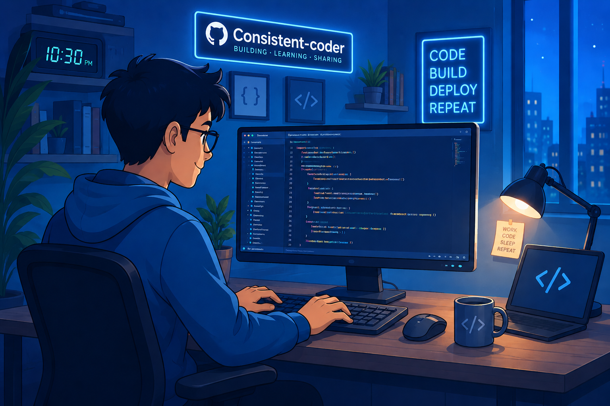

# Swastik Bhattacharyya

### Full Stack Developer  |  Problem Solver  |  AI Enthusiast

Building **production-grade web applications, scalable backend systems, and practical AI-powered solutions.**

 

&nbsp;

  

 

&nbsp;

---

## 👨‍💻 Profile

I am a **B.Tech graduate and Full Stack Developer** with professional experience building and maintaining **production-grade web applications** used by **thousands of users**.

My work spans the **complete development lifecycle** — from designing **interfaces and backend services** to working with **databases, asynchronous systems, APIs, and deployment workflows**. I enjoy building **end-to-end features** that solve **real-world problems** while keeping systems **scalable, maintainable, and reliable**.

I enjoy exploring **different areas of software engineering, emerging technologies, and new ways of solving complex problems**, with a strong focus on **continuously expanding my technical depth and perspective**.

---

# 💼 Experience

### Eubrics AI

**Full Stack & AI Development Intern · Full-Time**
`July 2025 — Present`

Worked on production applications used by **thousands of users**, contributing across frontend, backend, infrastructure-facing workflows, and AI-powered features.

* Delivered end-to-end features across production web applications.
* Worked with scalable backend architectures, asynchronous processing, queues, and optimized database workflows.
* Built reusable frontend and backend components adopted across multiple projects.
* Worked on real-time and computation-heavy application workflows.
* Integrated external enterprise platforms and services into application workflows.
* Developed AI-powered functionality using Generative AI and structured prompting.
* Worked with international users and applications requiring localization and timezone-aware behavior.
* Collaborated across teams from implementation through production delivery.

 

### EmployabilityLife (XPMC)

**Team Lead — Experiential Learning**
`September 2024 — July 2025`

Selected among the **top 120 students** from the university for an industry-oriented training program.

Led a **five-member team**, coordinating planning, collaboration, technical execution, and delivery across project activities.

---

# 🧩 What I Build

<table>
<tr>
<td width="50%" valign="top">

### ⚛️ Full Stack Applications

End-to-end applications with modern frontend architectures, robust APIs, authentication, databases, and production-focused workflows.

</td>

<td width="50%" valign="top">

### ⚙️ Backend Systems

Scalable services, asynchronous processing, queues, workers, caching, database optimization, and distributed workflows.

</td>
</tr>

<tr>
<td width="50%" valign="top">

### ⚡ Real-Time Applications

Systems involving WebSockets, real-time computation, collaboration, and event-driven communication.

</td>

<td width="50%" valign="top">

### ✨ AI-Powered Products

Practical integration of Generative AI into real applications, with an emphasis on useful workflows rather than AI for its own sake.

</td>
</tr>
</table>

---

# 🛠️ Technology

## Languages

---

## Frontend

---

## Backend & APIs

&nbsp;

---

## 💻 CLI & Developer Tooling

Custom command-line interfaces, commands, and developer-facing tooling using Node.js and TypeScript.

---

## 🗄️ Databases & Data

---

## 📨 Messaging & Distributed Systems

&nbsp;

&nbsp;

&nbsp;

---

## ☁️ Cloud, DevOps & Infrastructure

---

## 🤖 AI & Data Science

&nbsp;

&nbsp;

&nbsp;

&nbsp;

&nbsp;

---

## 🔧 Development & Collaboration

&nbsp;

---

# 🎓 Education

**2022 - 2026 | Sister Nivedita University**

Bachelor of Technology (B.Tech) – Computer Science and Engineering (Core)

---

# 🌐 Languages

---

 

# Let's Connect

I'm always interested in interesting engineering problems, ambitious products, and opportunities to build meaningful software.

 

&nbsp;&nbsp;

  

Driven by curiosity. Inspired by challenges. Focused on solutions.

